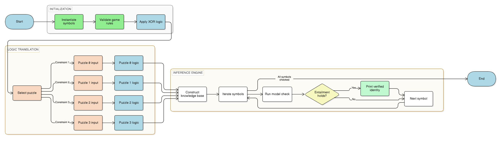

# **CS50 AI Knights and Knaves Project**
# **1. Planning**

**1.1 Key Terms Definitions**

The following key terms are defined to fully understand the concepts and logic discussed in this document:

- **Knowledge-Based Agent:** A system that reasons based on the internally given knowledge (sentences) to derive new information.

- **Knowledge Base (KB):** A set of sentences known to be true by the agent. In this project, the KB consists of the "Game Rules" (one can be either Knight or Knave) and the given "Puzzle Clues."

- **Entailment** ($KB \vDash \alpha$): The relationship where, if the Knowledge Base is true, then the conclusion ($\alpha$) must also be true.

- **Model Checking:** The algorithm used to enumerate all possibilities (truth tables) to verify entailment.

- **Biconditional ($\iff$):** A logical connective indicating that two statements share the exact same truth value (True/True or False/False).

**1.2 Concept & Rules (How Knights and Knaves Works)**

Before defining the goal, it is important to understand the rules of the Knights and Knaves puzzle. It is a logic puzzle created by mathematician Raymond Smullyan, set on an island where every inhabitant is one of two types:

- **Rule 1:** A **Knight** always tells the truth. If a character is a Knight, every statement they make must be true.
- **Rule 2:** A **Knave** always lies. If a character is a Knave, every statement they make must be false.
- **Rule 3:** Every character is exclusively either a Knight or a Knave — they cannot be both, and they cannot be neither.
- **Rule 4:** A character's type is fixed and permanent throughout the puzzle. It does not change between statements.

**1.3 Goal:**

Engineer a knowledge-based agent capable of solving the Raymond Smullyan "Knights and Knaves" puzzles. The agent reasons using propositional logic to infer the type (Knight or Knave) of various characters based on limited initial statements as constrained clues.

**1.4 Success Criteria**

To evaluate the accuracy of the agent, the following criteria must be met:

- The agent must accurately and strictly adhere to the laws of identity without any contradictions (e.g., one cannot be both Knight and Knave).
- The agent must yield exactly one valid model per symbol for Puzzles 0, 1, 2, and 3.
- The implementation should utilize reusable functions to enforce the game rules and logic gates (e.g., XOR). This avoids redundancy.
- The agent should successfully check that $KB \vDash \alpha$ based on the given cases in all puzzles.

**1.5 Project Requirements**

The technical boundaries and expected inputs/outputs for this project are outlined below:

- **Input:** Implicit rules derived from 4 specific logic puzzles.
- **Processing:** Converting English statements into logical connectives (And, Or, Not, Biconditional) via the `logic.py` library.
- **Output:** Console printout of the definitive status (Knight or Knave) of every character involved.

# **2. Analysis**

**2.1 Tools and Resources**

The following software tools and libraries were utilized to develop, test, and document this project, each serving a specific necessary function:

- **Python via VS Code**: The primary programming language and integrated development environment (IDE) used to write and execute the propositional logic agent.
- **Harvard `logic.py` library**: Provides the core logical connective classes (`And`, `Or`, `Not`, `Biconditional`, `Implication`) and the `model_check` function used to enumerate all truth-table possibilities and verify entailment.
- **Git/GitHub**: Used for version control to track incremental changes across each puzzle implementation.
- **draw.io**: Used to construct the design flowchart that visualizes the agent’s decision pipeline.

**2.2 Development Timeline**

The development of this project followed a structured timeline:

1. **Initialization:** Setup Git repo and analyze the `logic.py` library.
2. **Abstraction:** Create a reusable `validate_game_logic` function to handle the XOR game rule (one can be either Knight or Knave, not both).
3. **Puzzles 0 & 1:** Implement direct Biconditional statements mapping each speaker to their claim.
4. **Puzzle 2:** Implement "Same vs Different" logic using nested logic gates.
5. **Puzzle 3:** Implement nested Biconditionals for "He said that..." meta-statements.
6. **Verification:** Run `model_check` on all four puzzles and document results.

**2.3 Troubleshooting Techniques**

The following troubleshooting techniques are applied when unexpected results occur:

- If the output is empty, the KB contains a contradiction (e.g., asserting A and Not A simultaneously). Comment out individual sentences one at a time to isolate the conflicting rule.
- If the output lists a character as both Knight and Knave, the exclusive game rules are missing. Verify that `validate_game_logic` is being called for every character before the puzzle clues are added.
- If Puzzle 3 produces no output or loops unexpectedly, check for mismatched parentheses in the nested Biconditionals.

**2.4 General Logic Analysis**

Translating English into logic, we need to analyze the relationship between a speaker, their statement, and reality. This table below shows the two valid states of the model.

| Character (C) | Is Knight? | Always Tells Truth? | Statement (S) True? | Formula |
|:---:|:---:|:---:|:---:|:---:|
| Knight | Yes | Yes | True | $C \land S$ |
| Knave | No | No | False | $\neg C \land \neg S$ |

In both valid states, C and S share the same truth value, allowing us to use a biconditional operator: $$C \iff S$$ This is because a character is a Knight if and only if their statement is true.

**2.5 Puzzle 0 Analysis**

**Statement:** A says "I am both a Knight and a Knave."

We know that a Knight cannot lie, and a Knave cannot tell the truth. Since "Knight AND Knave" is logically impossible (False), if A were a Knight, he would be telling a lie (Impossible as Knight cannot lie). Therefore, A must be a Knave. The following table is the truth table of this puzzle.

| Case | A is Knight? | A's Statement | Statement True? | Valid? |
|:---:|:---:|:---:|:---:|:---:|
| 1 | Yes | "I am both a Knight and a Knave" | False (True AND False = False) | No (Knight said False) |
| 2 | No | "I am both a Knight and a Knave" | False (True AND False = False) | Yes (Knave said False) |

**2.6 Puzzle 1 Analysis**

**Statement:** A says "We are both Knaves."

If A is a Knight, he is telling the truth, so he is a Knave which contradicts. Thus, A must be a Knave. Since A is a Knave, his statement "We are both Knaves" must be False. For "A and B are Knaves" to be False (when we already know A is a Knave), B must be a Knight. The following table is the truth table of this puzzle.

| Case | A is Knight? | B is Knight? | A's Statement | Statement True? | Valid? |
|:---:|:---:|:---:|:---:|:---:|:---:|
| 1 | Yes | Yes | "We are both Knaves" | False | No (Knight said False) |
| 2 | Yes | No | "We are both Knaves" | False | No (Knight said False) |
| 3 | No | Yes | "We are both Knaves" | False | Yes (Knave said False) |
| 4 | No | No | "We are both Knaves" | True | No (Knave said True) |

**2.7 Puzzle 2 Analysis**

**Statement A:** "Same kind" $A \iff (A \land B) \lor (\neg A \land \neg B)$

**Statement B:** "Different kinds" $B \iff (A \land \neg B) \lor (\neg A \land B)$

A and B claim opposite things. Therefore, one must be telling the truth and one must be lying. If one lies and one truths, they are of "Different Kinds". This makes B's statement ("Different kinds") True. Since B told the truth, B is a Knight. Since they are different, A is a Knave. The following table is the truth table of this puzzle.

| Case | A is Knight? | B is Knight? | A's Statement True? | B's Statement True? | Logic Check | Valid? |
|:---:|:---:|:---:|:---:|:---:|:---:|:---:|
| 1 | Yes | Yes | True | False | B is Knight but said False | No |
| 2 | Yes | No | False | True | A is Knight but said False | No |
| 3 | No | Yes | False | True | A is Knave and said False; B is Knight and said True | Yes |
| 4 | No | No | True | False | A is Knave but said True | No |

**2.8 Puzzle 3 Analysis**

**Statement:** B says "A said 'I am a knave'."

We first check the inner statement asking ourselves Can A say "I am a Knave"? If A is a Knight he speaks the truth meaning he is a knave which contradicts. If A is a Knave, he speaks a lie meaning that he is a knight which contradicts. Therefore, A can never say "I am a Knave." Since A could not have said that, B is lying about what A said. Therefore, B is a Knave. Since B is a Knave, his statement "C is a Knave" is False. Therefore, C is a Knight. Since C is a Knight, his statement "A is a Knight" is True. Therefore A is a Knight. The following table is the truth table of this puzzle.

| Character | Is Knight? | Statement | Statement True? | Valid? |
|:---:|:---:|:---:|:---:|:---:|
| A | Yes | "I am a Knight" | True | Yes |
| B | No | "A said 'I am a Knave'" | False | Yes (Lied about A) |
| C | Yes | "A is a Knight" | True | Yes |

# **3. Design**

**3.1 Pseudocode**

Below is the pseudocode outlining the core logic for each required function:

```text
validate_game_logic(characters):

    For each character in characters:
        Add to KB: character is Knight OR character is Knave  (at least one must hold)
        Add to KB: NOT (character is Knight AND character is Knave)  (cannot be both)

puzzle_knowledge(speaker, statement):

    Add to KB: speaker is Knight IFF their statement is True
        (Biconditional: AKnight ⟺ statement)

    For meta-statements ("X said that Y said ..."):
        Add to KB: speaker is Knight IFF (target is Knight IFF inner statement is True)
        (Nested Biconditional: BKnight ⟺ (AKnight ⟺ inner_statement))

main():

    Initialize symbols for each character (AKnight, AKnave, BKnight, BKnave, etc.)

    Build KB:
        Call validate_game_logic for all characters in puzzle
        Add puzzle-specific biconditionals to KB

    For each symbol:
        If model_check(KB, symbol) is True:
            Print character as Knight or Knave
```

The program runs in two sequential phases. First, `validate_game_logic` enforces the game rules by expressing the exclusive OR constraint for every character, preventing contradictions before any puzzle-specific clues are added. Then `puzzle_knowledge` translates each English statement into a biconditional and adds it to the KB. Once the KB is fully built, `model_check` iterates through every possible truth assignment and confirms the identity of each character.

**3.2 Flowchart**

The flowchart below visually represents this sequential execution and decision-making logic:


# **4. Testing**

**Summary:**

The following test cases were executed to validate the accuracy of the agent:

| Test Case | Description | Expected Outcome | Pass/Fail |
|:---:|:---:|:---:|:---:|
| 1 | Run Puzzle 0 | A is a Knave | Pass |
| 2 | Run Puzzle 1 | A is a Knave, B is a Knight | Pass |
| 3 | Run Puzzle 2 | A is a Knave, B is a Knight | Pass |
| 4 | Run Puzzle 3 | A is a Knight, B is a Knave, C is a Knight | Pass |

**4.1 Detailed Output Verification**

To further validate the accuracy of the agent, the actual outputs were compared against the manually derived solutions for all four puzzles:

**Puzzle 0**
| Character | Expected Type | Actual Output | Verification |
|:---:|:---:|:---:|:---:|
| A | Knave | Knave | Match |

**Puzzle 1**
| Character | Expected Type | Actual Output | Verification |
|:---:|:---:|:---:|:---:|
| A | Knave | Knave | Match |
| B | Knight | Knight | Match |

**Puzzle 2**
| Character | Expected Type | Actual Output | Verification |
|:---:|:---:|:---:|:---:|
| A | Knave | Knave | Match |
| B | Knight | Knight | Match |

**Puzzle 3**
| Character | Expected Type | Actual Output | Verification |
|:---:|:---:|:---:|:---:|
| A | Knight | Knight | Match |
| B | Knave | Knave | Match |
| C | Knight | Knight | Match |

- Puzzle 0 is the simplest case, involving a single character making a self-contradicting claim. Since "I am both a Knight and a Knave" is always logically false, no Knight could say it. The agent correctly identified A as a Knave.
- Puzzle 1 introduces a second character. Since A's statement forces a contradiction if A is a Knight, the agent deduced A is a Knave and, by the falseness of A's claim, confirmed B is a Knight.
- Puzzle 2 is the first case where two characters make opposing claims. A and B cannot both be right since their statements are mutually exclusive. The agent correctly used the biconditional to determine that B's "different kinds" claim is the one that holds, making B a Knight and A a Knave.
- Puzzle 3 is the most complex case, requiring nested biconditionals to handle a meta-statement. The key insight is that A can never truthfully say "I am a Knave," so B's report of that statement must be false. This single deduction propagates to correctly identify all three characters.

# **5. Deployment & Maintenance**

The propositional logic approach used in this project can be applied beyond puzzles to any domain that requires formal rule-based reasoning. Automated legal compliance checking uses the same biconditional structure to determine whether an agent's actions satisfy a defined ruleset. In natural language processing, the same inference engine could validate logical consistency across a set of parsed user statements.

The most significant future improvement would be scaling the model checker. The current `model_check` function uses brute-force enumeration, which grows exponentially as the number of characters increases. For larger puzzles, a resolution-based inference algorithm or a SAT solver would dramatically reduce search time. Another improvement would be supporting first-order logic so the agent could reason about quantified statements like "Everyone on the island is a Knight."