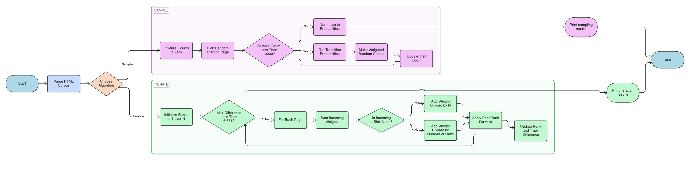

# **CS50 AI PageRank Project**
# **1. Planning**

**1.1 Key Terms Definitions**

The following key terms are defined to fully understand the concepts and mathematical variables discussed in this document:

- **Random Surfer Model (model):** A stochastic model simulating the behavior of an internet surfer who randomly clicks on links. It assumes that if a user is on a page with many links, they are equally likely to click any of them (if a page has L links, the probability of the surfer clicking any specific link is $1/L$).

- **Markov Chain:** A mathematical model that undergoes transitions from one state (web page) to another according to certain probabilistic rules. The next state depends only on the current state (state attained in the previous event).

- **Damping Factor ($d$):** A probability factor (typically 0.85) representing the likelihood that a user continues clicking links. On the other hand, probability $1-d$ (0.15) represents the likelihood that the user "teleports" to a completely random page in the corpus.

- **Convergence:** The state at which the calculated PageRank values stabilize, changing by no more than a specified threshold (0.001) between iterations.

- **Sink Node (Dead End):** A web page that has no outgoing links (a "Dead End").

**1.2 Concept & Rules (How PageRank Works)**

Before defining the goal, it is important to understand the rules of the PageRank algorithm. PageRank determines the importance of a web page based on the incoming links it receives.

- **Rule 1:** A page is considered more important if it is linked to by other important pages.
- **Rule 2:** A user navigates the web by either clicking a link on their current page (with probability $d$) or typing a completely random URL to jump to any page in the entire network (with probability $1-d$).
- **Rule 3:** If a user reaches a "Sink Node" (a page with no links), they will not get stuck; instead, they will randomly teleport to any page in the network with equal probability.

**1.3 Goal:**

Engineer a knowledge-based AI agent capable of determining the importance (PageRank) of web pages within a corpus. The solution will implement two distinct methodologies: approximating rank via Sampling (Markov Chain) and calculating exact rank via Iteration (Recursive Formula).

**1.4 Success Criteria**

To evaluate the effectiveness and accuracy of the algorithm, the following success criteria must be met:

- The model must return a probability distribution that always sums to 1. It must accurately handle "Sink Nodes" (pages with no outgoing links), treating them as linking to all pages to prevent probability loss.
- The sample pagerank function must yield results statistically consistent within approximately 0.05 margin with the iterative approach.
- The iterate pagerank function must correctly handle Corpus 2 using recursion and dead ends. The iteration loop must achieve convergence (terminate) when the maximum change in any page rank is $< 0.001$.
- The implementation should utilize a reusable function to enfore the damping factor rules consistently.

**1.5 Project Requirements**

The technical boundaries and expected inputs/outputs for this project are outlined below:

- **Input:** A directory (corpus) containing HTML files.
- **Processing:** Parsing HTML structure, building an adjacency dictionary, and then calculating probabilities.
- **Output:** A sorted console printout of pages and their calculated PageRank values (e.g., 1.html: 0.2202).

# **2. Analysis**

**2.1 Tools and Resources**

The following software tools and libraries were utilized to develop, test, and document this project, each serving a specific necessary function:

- **Python 3.12 via VS Code**: The primary programming language and integrated development environment (IDE) used to write and execute the algorithmic logic.
- **Libraries**
    - **os**: A built-in Python module used to navigate the directory structure of the corpus and safely access the HTML files regardless of the operating system.
    - **re**: Used for regular expressions toparse the HTML file contents and extract the `href` link tags connecting the pages.
    - **random**: Specifically `random.choices`, used to simulate the Random Surfer by making weighted random selections based on our computed probability distributions.
- **Git/GitHub**: Used for version control
- **draw.io**: Used to construct the algorithm flowchart

**2.2 Development Timeline**

The development of this project followed a structured timeline:

1. **Initialization:** Setup Git repo and analyze the crawl() function.
2. **Logic for probability:** Implement transition_model function to return a dictionary of probabilities summing to 1.
3. **Sampling pagerank:** Implement sample_pagerank using weighted random selection (random.choices).
4. **Iterate pagerank** Implement iterate_pagerank using the recursive formula.
5. **Refinement:** Handle the Sink Node edge case in Corpus 2.
6. **Verification:** Run model checks on all corpora and document results.

**2.3 Troubleshooting Techniques**

The following troubleshooting techniques are applied when unexpected results occur:

- If PageRank values do not sum to 1, we must verify that the teleportation probability $\frac{1-d}{N}$ is added to every page.
- If the iterative algorithm runs endlessly, we should check if abs() is being used when calculating the difference between old and new ranks.
- If Corpus 2 results are unexpectedly low (e.g., 0.05), we must verify that the Sink Nodes are explicitly handled in the loop.

**2.4 General Logic Analysis**

Translating the web structure into logic, we need to analyze the relationship between the Damping Factor, the Links, and the Probability. After analysis, we can derive the formula below:

$$
PR(p) = \frac{1 - d}{N} + d \sum_{i} \frac{PR(i)}{NumLinks(i)}
$$

To derive this formula, we analyze the probability of a random surfer arriving at page p through two mutually exclusive events.
 1. The Teleportation term ($\frac{1-d}{N}$) accounts for the $1-d$ (15%) probability that a user types a random URL directly. Since they can choose any of the N pages in the corpus with equal likelihood, the probability for landing on page p via teleportation is $\frac{1}{N}$. 
 2. The Surfing term ($d \sum \dots$) accounts for the $d$ (85%)probability that a user follows a link. For a user to arrive at page $p$ by clicking, they must currently be on a page $i$ that links to $p$. The probability they are on page $i$ is $PR(i)$. The probability they choose the specific link to $p$ is $\frac{1}{NumLinks(i)}$. We sum this probability for all pages $i$ that link to $p$.

This table below shows how the user's behavior into two distinct states:
| Independent Variable (Behavior) | Logic State | Formula Term | Resulting Probability |
|:---:|:---:|:---:|:---:|
| Teleport | User types a random URL | $\frac{1-d}{N}$ | 0.15 / Total Pages |
| Surf | User clicks a specific link | $d \times \frac{PR(i)}{NumLinks(i)}$ | 0.85 / Link Count |

**2.5 Corpus 0 Analysis (Standard Case)**

**Structure:** A small network where every page has at least one link. 

We know that page 2 is linked to by page 1 and page 3. Since page 1 and 3 are also linked to each other, they feed probability into page 2. Page 4 is only linked to by page 2. Therefore, we expect Page 2 to have the highest rank.

| Page | Links To... | Expected Rank | Logic |
|:---:|:---:|:---:|:---:|
| 1.html | 2 | Moderate | Receives link from 2 |
| 2.html | 1, 3 | Highest | Receives links from 1 and 3 |
| 3.html| 2, 4 | Moderate | Receives link from 2 |
| 4.html | 2 | Lowest | Only receives link from 3 |

**2.6 Corpus 1 Analysis**

**Structure:** bfs to dfs to search to bfs.

This corpus represents a recursion with probabilities flows in a loop. We observe that games, minesweeper, and tictactoe are the leaf nodes being fed by search. However, search itself is fed by dfs, which is fed by bfs. Because search is the hub that feeds the leaf nodes and recycles probability back to bfs, it should hold significant weight.


| Page | Links To... | Expected Rank | Logic |
|:---:|:---:|:---:|:---:|
| bfs.html | dfs | Moderate | Feeds Loop |
| dfs.html | minimax, search | Moderate | Feeds Loop |
| search.html | bfs, games, etc. | Highest | Hub Node |
| games.html | (None) | Low | Leaf Node |

**2.7 Corpus 2 Analysis (Sink Node Edge Case)**

**Structure:** recursion.html has no outgoing links.
In a standard formula, NumLinks(i) would be 0, leading to a loss of probability (division by zero and logic skip). To fix this, we can apply the rule that if len(links) == 0, treat as len(links) == N.


| Case | Page Type | Standard Logic | Corrected Logic | Verification |
|:---:|:---:|:---:|:---:|:---:|
| 1 | Standard Page | Sums incoming weights | Sums incoming weights | Valid |
| 2 | Sink Node | Probability Leaks (0.05) | Redistributes Weight (about 0.33) | Valid |


# **3. Design**

Below is the pseudo code outlining the core logic for each required function:

```text
transition_model(page, corpus, damping_factor):

    if page has outgoing links:
        Probability of visiting each linked page = (damping_factor / number of links)
        Probability of teleportation to any page = (1 - damping_factor) / total pages
    else:
        Equal probability for all pages (random jump)
    Return probability distribution

sample_pagerank(corpus, damping_factor, n):

    Choose a random page as the starting page
    Initialize PageRank dictionary with zero values
    For i in range(n):
        Choose next page based on transition_model probabilities
        Update PageRank count
    Normalize PageRank values (convert visit counts to probabilities)
    Return PageRank dictionary

iterate_pagerank(corpus, damping_factor):

    Initialize all pages with equal PageRank (1 / total pages)
    Repeat until PageRank values converge:
        For each page:
            Compute new PageRank using:
            New PR = (1 - damping_factor) / total pages
                     + damping_factor * sum(PageRank of linking pages / number of their links)
```

The pseudo code above shows that the program will run in two distinct sequential phases. First, it will execute the sampling (`sample_pagerank`), using the `transition_model` to simulate 10,000 random clicks. Second, it will execute the iterating (`iterate_pagerank`), using a continuous mathematical loop until the values stabilize.

The flowchart below visually represents this sequential execution and decision-making logic:


# **4. Testing**
**Summary:**

The following test cases were executed to validate the accuracy of the algorithm:

| Test Case | Description | Expected Outcome | Pass/Fail |
|:---:|:---:|:---:|:---:|
| 1 | Run Corpus 0 | Page 2 has highest rank (~0.42) | Pass |
| 2 | Run Corpus 1 | Sampling results match Iteration within ~0.05 | Pass |
| 3 | Run Corpus 2 | recursion.html is ~0.33 (Successfully handled Sink Node) | Pass | 
| 4 | Convergence | Iteration stops automatically when stable | Pass |

**4.1 Detailed Output Verification**

To further validate the precision of the algorithm, the actual outputs were compared against the mathematically expected PageRank values for every page in each corpus:

**Corpus 0**
| Page | Expected Rank | Actual Rank | Verification |
|:---:|:---:|:---:|:---:|
| 1.html | 0.2202 | 0.2202 | Match |
| 2.html | 0.4289 | 0.4289 | Match |
| 3.html | 0.2202 | 0.2202 | Match | 
| 4.html | 0.1307 | 0.1307 | Match |

**Corpus 1**
| Page | Expected Rank | Actual Rank | Verification |
|:---:|:---:|:---:|:---:|
| bfs.html | 0.1151 | 0.1151 | Match |
| dfs.html | 0.0806 | 0.0806 | Match |
| games.html | 0.2272 | 0.2272 | Match |
| minesweeper.html | 0.1183 | 0.1183 | Match |
| minimax.html | 0.1305 | 0.1305 | Match |
| search.html | 0.2100 | 0.2100 | Match |
| tictactoe.html | 0.1183 | 0.1183 | Match |

**Corpus 2**
| Page | Expected Rank | Actual Rank | Verification |
|:---:|:---:|:---:|:---:|
| ai.html | 0.1344 | 0.1344 | Match |
| algorithms.html | 0.0762 | 0.0762 | Match |
| c.html | 0.0888 | 0.0888 | Match |
| inference.html | 0.0921 | 0.0921 | Match |
| logic.html | 0.0188 | 0.0188 | Match |
| programming.html | 0.1637 | 0.1637 | Match |
| python.html | 0.0888 | 0.0888 | Match |
| recursion.html | 0.3372 | 0.3372 | Match |

- Corpus 0  is considered a normal case, where each web page directs to another one, without any dead ends or self-directed pages. As shown in the chart, the actual output determined by the algorithm perfectly matches the expected output, which tells that the algorithm gives the correct probabilities in normal test cases. 
- Corpus 1 is an example of a recurring case, where bfs directs to dfs, dfs directs to search, and eventually search.html directs back to bfs. Although this could affect the probability distribution among the web pages, the outcome still matched the expected outputs, which means the algorithm still functions properly under this circumstance. 
- Corpus 2 on the other hand, exemplifies a dead end case, where recursion.html only points to itself and no other web pages are directed by which. With expectations, the probability of recursion.html resulted in a greatly different number of the expected output, where the expected probability of which is 0.3372, while the actual output was only 0.0510. This suggests that the algorithm can not deal with dictionaries that exist web pages only directed to itself, forming a dead end structure. 

# **Deployment & maintenance**

The page rank algorithm can be widely used in search engines like Google, where it ranks the importance of web pages based on their relevance and importance. Similarly to search engines, the algorithm can also be used in academic research analysis, to determine influential research papers. Beyond searching methods, the page rank algorithm can also be applied to social media content analysis, where it prioritizes the contents that display to users based on the importance to them. 

The major future improvement will be focused on dealing with more complex cases, for example cases that contain a dead end where a web page only directs to itself. Apart from that, the algorithm can work on the tuning of the damping factor, which is a really important factor that directly affects the final outcome. 