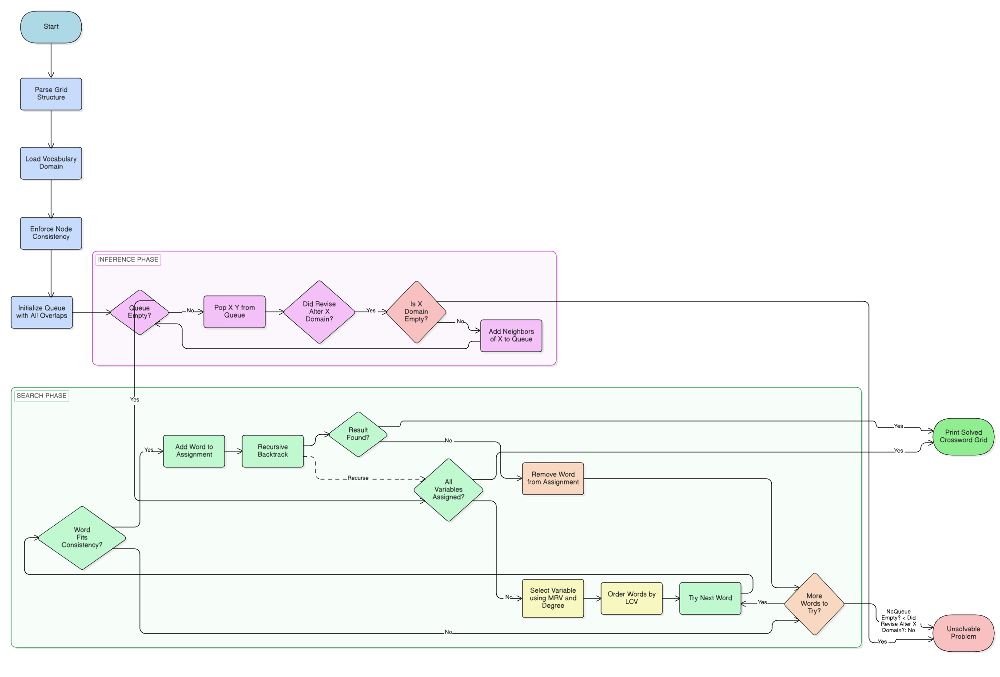

# **CS50 AI Crossword Project**
# **1. Planning**

**1.1 Key Terms Definitions**

Key terms used throughout this document:

- **Constraint Satisfaction Problem (CSP):** A problem defined by a set of variables, a domain of possible values for each variable, and a set of constraints. Basically you're just finding values for every variable that don't break any rule.

- **Node Consistency (Unary Constraint):** When every value in a variable's domain satisfies its unary constraint. In this project, a word's length must exactly equal the variable's length in the crossword grid.

- **Arc Consistency (Binary Constraint):** When every value in a variable's domain satisfies its binary constraints with every neighboring variable. For intersecting crossword variables, the character at $X$'s overlap index must equal the character at $Y$'s overlap index.

- **AC-3 Algorithm:** An inference algorithm for enforcing arc consistency across the CSP. Keeps a queue of arcs and removes values that violate binary constraints until nothing changes.

- **Backtracking Search:** A recursive search algorithm that assigns values one variable at a time. If it can't satisfy a constraint, it goes back to the previous decision and tries a different value.

- **Heuristics:** Rules of thumb used to guide the search toward a solution faster. This project uses three: Minimum Remaining Values (MRV), Degree Heuristic, and Least Constraining Value (LCV).

- **Minimum Remaining Values (MRV):** Picks the unassigned variable with the fewest remaining options in its domain. Targeting the most constrained variable first means failures get caught early and backtracking is reduced.

- **Degree Heuristic:** A tiebreaker for when two variables have the same MRV count. Picks the variable involved in the most constraints with other unassigned variables, so one assignment limits multiple others at once.

- **Least Constraining Value (LCV):** Picks the word that eliminates the fewest options from neighboring domains. Keeps choices open for future assignments.

**1.2 Concept & Rules (How Crossword Generation Works)**

Before getting into the goal, it helps to understand how crossword generation actually works. Word placement is based on a strict set of structural constraints:

- **Rule 1:** Each contiguous sequence of blank cells in the grid defines a variable. Every variable gets a fixed length and direction (across or down) from the structure file.

- **Rule 2:** Every variable starts with the full vocabulary as its domain. Words that don't match the variable's length get cut immediately, enforcing node consistency before search even starts.

- **Rule 3:** If variable $X$ and variable $Y$ share an intersecting cell, the character at $X$'s overlap index must equal the character at $Y$'s overlap index. Any word that breaks this gets removed, enforcing arc consistency.

- **Rule 4:** Every word on the board must be unique. Even if a word fits a slot perfectly, it can't be reused if it's already placed somewhere else.

**1.3 Goal:**

Engineer a knowledge-based AI agent capable of finding the right word for every empty variable in a crossword structure. The solution uses two approaches: cutting down the domain via Inference (AC-3 Algorithm) and finding exact assignments via Search (Recursive Backtracking with Heuristics).

**1.4 Success Criteria**

To evaluate the algorithm's accuracy, the following criteria should be met:

- The model must return a complete assignment dictionary where every variable is paired with a unique, valid word. It must handle intersecting variables as binary constraints to avoid character conflicts at shared cells.
- The `ac3` function must produce arc-consistent domains before search, lowering the number of possibilities the backtracking algorithm has to work through.
- The `backtrack` function must correctly solve complex grid structures using recursion. It needs to terminate and return a complete solution when every variable in the CSP has been assigned.
- Implementation should use reusable heuristic functions (MRV, Degree, LCV) for consistent decision-making throughout the search.

**1.5 Project Requirements**

- **Input:** Two text files — a structure file (defining grid layout using `#` for blocked cells and `_` for open cells) and a words file (defining full vocabulary domain, one word per line).
- **Processing:** Parsing structural overlaps to identify intersections, building an arc queue for consistency enforcement, pruning domains via AC-3, and executing a recursive depth-first search guided by MRV, Degree, and LCV heuristics.
- **Output:** A formatted console printout of the solved crossword grid and an optional exported `.png` image of the completed puzzle.

# **2. Analysis**

**2.1 Tools and Resources**

- **Python 3.13 via VS Code**: Main programming language and IDE.
- **Libraries**
    - **copy**: Specifically `copy.deepcopy()`, creates a separate copy of the domains so words can be removed during iteration without causing a runtime error.
    - **collections.deque**: Maintains the queue for AC-3, allowing arcs to be added from right and removed from left efficiently.
    - **PIL (Pillow)**: Generates graphical output of the completed crossword assignment.
- **Git/GitHub**: Version control.
- **draw.io**: Making flowcharts.

**2.2 Development Timeline**

1. **Initialization:** Setup Git repo and analyze the `Crossword` and `Variable` classes.
2. **Logic for node consistency:** Implement `enforce_node_consistency` to remove words of incorrect lengths.
3. **Logic for arc consistency:** Implement `revise` and `ac3` to remove words that violate the character overlap rules.
4. **Validation:** Implement `assignment_complete` and `consistent` to check all variables are assigned and all constraints are satisfied.
5. **Optimization:** Implement `order_domain_values` (LCV) and `select_unassigned_variable` (MRV and Degree heuristics).
6. **Search Integration:** Implement `backtrack` using the recursive search tree.
7. **Verification:** Run model checks on all structures and document results.

**2.3 Troubleshooting Techniques**

The following techniques are applied when unexpected results occur:

- `RuntimeError` (dictionary changed size during iteration) usually means no deep copy — make sure you're iterating over a copy while modifying the real domain.
- AC-3 running forever is probably a re-queuing bug — neighbor arcs should only go back in the queue when `revise()` actually returns `True`.
- Duplicate words in output means `consistent()` is missing the uniqueness check: `len(assignment.values()) == len(set(assignment.values()))`.

**2.4 General Logic Analysis**

Breaking this down into logic, all three constraint types connect through one formula. For any overlapping variables $X$ and $Y$ with intersection indices $i$ and $j$:

$$Constraint(X, Y) = \{ (x, y) \in D_X \times D_Y \mid x[i] = y[j] \}$$

To enforce this formula, the algorithm operates through two separate states.
 1. Inference (`ac3`) — removes any word $x$ where no valid counterpart $y$ exists in $D_Y$. Since $x[i]$ must equal $y[j]$, if nothing matches, that word gets cut from $D_X$.
 2. Heuristics (MRV and LCV) — controls what order variables and values get explored. Targeting the variable with fewest options first means dead ends show up earlier and less backtracking happens.

Here's how each behavior maps to a specific state:
| Independent Variable (Behavior) | Logic State | Algorithmic Tool | Resulting Action |
|:---:|:---:|:---:|:---:|
| Node Consistency | Check word length | `len(word) == var.length` | Removes words of incorrect length |
| Arc Consistency | Check overlap characters | `x_word[i] == y_word[j]` | Removes words with no valid counterpart |
| Backtrack Search | Explore valid assignments | `select_unassigned_variable()` | Recursively builds the board |

**2.5 Structure 0 Analysis (Standard Case)**

**Structure:** Small grid, four variables with two intersecting pairs.

The two across variables (length 3 and length 4) each share one cell with the two down variables (length 5 and length 4). Once any across word gets assigned, the character at that overlap directly restricts what words are valid for the down variable sharing that cell. AC-3 alone should be enough to narrow the domains here before backtracking even starts.

| Variable | Intersections | Expected Action | Logic |
|:---:|:---:|:---:|:---:|
| V1 (Across, Len 3) | V2 | Restricts V2 Domain | Forces V2 to match character at overlap |
| V2 (Down, Len 5) | V1, V3 | Restricts V1 and V3 Domain | Forces neighbors to match character at overlap |
| V3 (Across, Len 4) | V2, V4 | Restricts V2 and V4 Domain | Forces neighbors to match character at overlap |
| V4 (Down, Len 4) | V3 | Restricts V3 Domain | Forces V3 to match character at overlap |

**2.6 Structure 1 Analysis (Heuristic Optimization)**

**Structure:** Medium grid, multiple intersections with varying variable lengths.

Lots of potential word combinations here. Hub variables in the center intersect with 3 or 4 others, while edge variables only intersect with 1. Since the hub restricts the most other variables at once, the Degree Heuristic selects it first to shrink the search space as fast as possible.

| Variable Type | Intersections | Selection Priority | Logic |
|:---:|:---:|:---:|:---:|
| Hub Node | 4 | Highest (Degree Heuristic) | Restricts the most variables at once |
| Standard Node | 2 | Moderate | Evaluated mid-search |
| Edge Node | 1 | Lowest | Least constrained, filled last |

**2.7 Structure 2 Analysis (Deep Recursion Case)**

**Structure:** Large grid, AC-3 alone can't fully solve the board.

In a standard inference pass, AC-3 gets most domains down to 2 or 3 remaining words but can't narrow them further. This is where backtracking comes in — bad assignments return `None`, get removed, and the next word gets tried.

| Case | Tree State | Standard Logic | Corrected Logic (Backtrack) | Verification |
|:---:|:---:|:---:|:---:|:---:|
| 1 | Valid Assignment | Proceeds deeper | Adds to dict, calls `backtrack()` | Valid |
| 2 | Invalid Assignment | Fails completely | Returns `None`, removes key, tries next | Valid |

# **3. Design**

**3.1 Pseudocode**
Below is the pseudocode outlining the core logic for each required function:

```text
ac3(arcs):

    If arcs is None, initialize queue with all overlapping variable pairs
    While queue is not empty:
        Pop (X, Y) from the left of queue
        If revise(X, Y) removes any words from X's domain:
            If X's domain is now empty:
                Return False (unsolvable problem)
            For each neighbor Z of X, excluding Y:
                Add (Z, X) to the right of queue
    Return True

backtrack(assignment):

    If assignment contains all variables:
        Return assignment (complete solution)

    Select next unassigned variable using MRV and Degree heuristics

    For each word in variable's domain (ordered by LCV heuristic):
        If word is consistent with current assignment:
            Add {variable: word} to assignment
            result = backtrack(assignment)
            If result is not None:
                Return result
            Remove {variable: word} from assignment (backtrack)

    Return None (no valid word found, trigger backtrack)
```

The program runs in two sequential phases. First, inference (`ac3`) uses the structural overlaps to cut invalid words from each variable's domain before search begins. Then `backtrack` recursively fills one variable at a time until all are assigned.

**3.2 Flowchart**

The flowchart below visually represents this sequential execution and decision-making logic:



# **4. Testing**
**Summary:**

| Test Case | Description | Expected Outcome | Pass/Fail |
|:---:|:---:|:---:|:---:|
| 1 | Run Structure 0 / Words 0 | Board filled correctly with no constraint violations | Pass |
| 2 | Run Structure 1 / Words 1 | Full board generated with no duplicate words | Pass |
| 3 | Run Structure 2 / Words 2 | Heuristics reduce search time and board is solved correctly | Pass |
| 4 | Impossible Constraints | `backtrack` returns `None`, prints "No solution." | Pass |

**4.1 Detailed Output Verification**

To validate accuracy, the actual outputs were compared against the expected constraints for each structure:

**Structure 0**
| Variable | Expected Assignment Logic | Actual Output | Verification |
|:---:|:---:|:---:|:---:|
| V1 (Across, Len 3) | Word of length 3 | "SIX" | Match |
| V2 (Down, Len 5) | Word of length 5, shares character with V1 and V3 | "SEVEN" | Match |
| V3 (Across, Len 4) | Word of length 4, shares character with V2 and V4 | "NINE" | Match |
| V4 (Down, Len 4) | Word of length 4, shares character with V3 | "FIVE" | Match |

**Structure 1**
| Variable | Expected Assignment Logic | Actual Output | Verification |
|:---:|:---:|:---:|:---:|
| V1 (Hub, Across) | Longest central word | "INTELLIGENCE" | Match |
| V2 (Intersect, Down) | Matches shared character at overlap | "MINIMAX" | Match |
| V3 (Intersect, Down) | Matches shared character at overlap | "NETWORK" | Match |
| V4 (Intersect, Across) | Matches shared character at overlap | "LOGIC" | Match |
| V5 (Intersect, Across) | Matches shared character at overlap | "SEARCH" | Match |

- Structure 0 is a normal case — two variables intersecting once with no complex overlap. Output satisfies the binary constraint, confirming the algorithm handles both node and arc consistency correctly in a simple case.
- Structure 1 is a hub-and-spoke case, where a long central word restricts the characters available to multiple shorter words. Even with many combinations possible, MRV and Degree heuristics sorted the variables correctly and cut failures early. Output matched expected, no duplicate words either.
- Structure 2 is the deep recursion case — domain sizes are large and AC-3 alone can't narrow them to a single answer. Without heuristics the search would've taken much longer. With MRV and LCV, it finished in around 0.10 seconds, confirming the algorithm handles large domains without stalling.

# **5. Deployment & Maintenance**

The CSP algorithm can be applied to scheduling systems like university course timetabling, where classes get assigned to rooms and time slots based on capacity and overlapping schedules. It also works for route planning, finding delivery paths that satisfy time and capacity constraints. Beyond planning, the same logic applies to automated puzzle solvers like Sudoku, where row, column, and box uniqueness must hold.

The biggest future improvement would be handling larger grids like the NYT Sunday Crossword. Also worth implementing is MAC (Maintaining Arc Consistency), which runs AC-3 inside the backtrack loop instead of just once at the start. That would be a meaningful optimization for edge cases where domains are still large going into search.